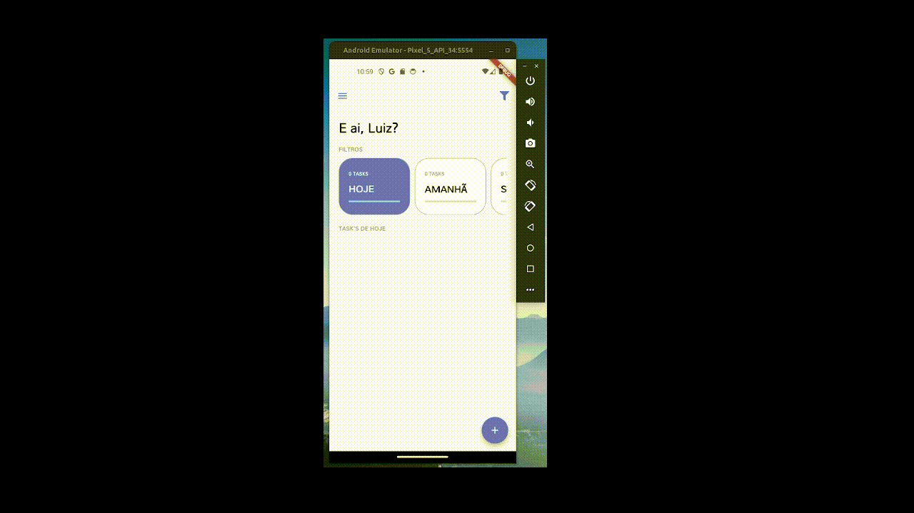

<h1 align="center">
   
  
   
  Todo List
   
</h1>

<h4 align="center">Um simples aplicativo de listagem de tarefas.</h4>

  <a href="#key-features">Features</a> •
  <a href="#credits">Creditos</a> •

## Features

* Listagem de tarefas com filtro de data
* Autenticação Firebase com Google Login
* Armazenamento SQLite 
* Arquitetura Modular com Provider

## Creditos

Este projeto utiliza, dentre outros, os seguintes packages:

- [Provider](https://pub.dev/packages/provider)
- [SQFlite](https://pub.dev/packages/sqflite)
- [Firebase](https://pub.dev/packages/firebase_auth)

---

> [Portfolio](https://luizgfalqueto.github.io/) &nbsp;&middot;&nbsp;
> GitHub [@luizgfalqueto](https://github.com/luizgfalqueto)

